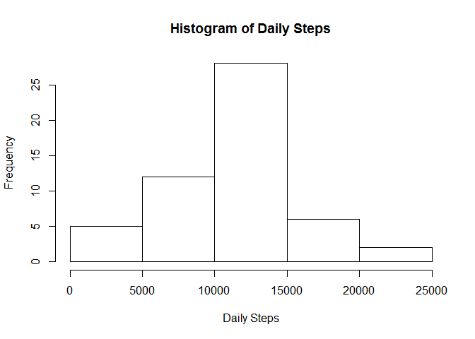
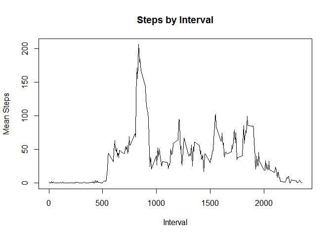
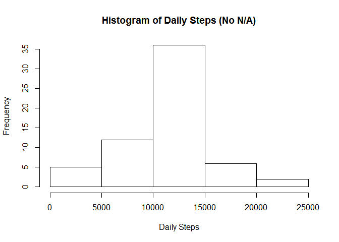
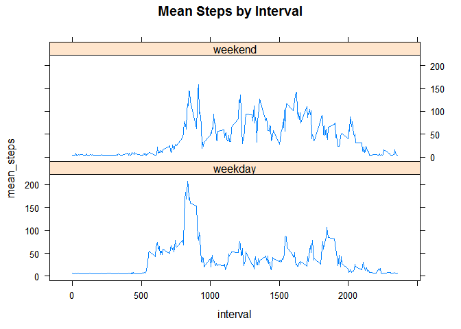

## Reading Data

1. Loading and preprocessing the data

2. Show any code that is needed to:

- Load the data (i.e.read.csv())
- Process/transform the data (if necessary) into a format suitable for your analysis

Load data, check class, convert 'date' column from factor to date.


```r
library(lubridate)
```

```
## 
## Attaching package: 'lubridate'
```

```
## The following objects are masked from 'package:base':
## 
##     date, intersect, setdiff, union
```

```r
data <- read.csv('./activity.csv')

summary(data)
```

```
##      steps                date          interval     
##  Min.   :  0.00   2012-10-01:  288   Min.   :   0.0  
##  1st Qu.:  0.00   2012-10-02:  288   1st Qu.: 588.8  
##  Median :  0.00   2012-10-03:  288   Median :1177.5  
##  Mean   : 37.38   2012-10-04:  288   Mean   :1177.5  
##  3rd Qu.: 12.00   2012-10-05:  288   3rd Qu.:1766.2  
##  Max.   :806.00   2012-10-06:  288   Max.   :2355.0  
##  NA's   :2304     (Other)   :15840
```

```r
sapply(data, class)
```

```
##     steps      date  interval 
## "integer"  "factor" "integer"
```

```r
data$date <- ymd(data$date)
summary(data)
```

```
##      steps             date               interval     
##  Min.   :  0.00   Min.   :2012-10-01   Min.   :   0.0  
##  1st Qu.:  0.00   1st Qu.:2012-10-16   1st Qu.: 588.8  
##  Median :  0.00   Median :2012-10-31   Median :1177.5  
##  Mean   : 37.38   Mean   :2012-10-31   Mean   :1177.5  
##  3rd Qu.: 12.00   3rd Qu.:2012-11-15   3rd Qu.:1766.2  
##  Max.   :806.00   Max.   :2012-11-30   Max.   :2355.0  
##  NA's   :2304
```

## What is mean total number of steps taken per day?

For this part of the assignment, you can ignore the missing values in the dataset.

- Calculate the total number of steps taken per day


```r
daily_steps <- aggregate(data$steps, by=list(data$date), sum)
colnames(daily_steps) <- c("Date", "Steps")
daily_steps <- na.omit(daily_steps)
```


```r
hist(daily_steps$Steps, main = 'Histogram of Daily Steps', xlab = 'Daily Steps')
```

<!-- -->

- Calculate and report the mean and median of the total number of steps taken per day


```r
meanone <- mean(daily_steps$Steps)
meanone
```

```
## [1] 10766.19
```

```r
medianone <- median(daily_steps$Steps)
medianone
```

```
## [1] 10765
```

## What is the average daily activity pattern?

- Make a time series plot (i.e., type = "l") of the 5-minute interval (x-axis) and the average number of steps taken, averaged across all days (y-axis)


```r
data_no_na <- na.omit(data)
steps_by_time <- aggregate(data_no_na$steps, by = list(data_no_na$interval), mean)
colnames(steps_by_time) <- c("Interval", "Steps")
steps_by_time <- na.omit(steps_by_time)
plot(steps_by_time$Interval, steps_by_time$Steps, type = 'l', main = 'Steps by Interval',
     xlab = 'Interval', ylab = 'Mean Steps')
```

<!-- -->

- Which 5-minute interval, on average across all the days in the dataset, contains the maximum number of steps?


```r
steps_by_time[which(steps_by_time$Steps == max(steps_by_time$Steps)), ]
```

```
##     Interval    Steps
## 104      835 206.1698
```

## Imputing missing values

Note that there are a number of days/intervals where there are missing values (coded as NA). The presence of missing days may introduce bias into some calculations or summaries of the data.

- Calculate and report the total number of missing values in the dataset (i.e. the total number of rows with NAs)


```r
colSums(is.na(data))
```

```
##    steps     date interval 
##     2304        0        0
```
- Devise a strategy for filling in all of the missing values in the dataset. The strategy does not need to be sophisticated. For example, you could use the mean/median for that day, or the mean for that 5-minute interval, etc.

Fill NA with the column mean

- Create a new dataset that is equal to the original dataset but with the missing data filled in.


```r
newdata <- data

for(i in 1:ncol(data)){
  newdata[is.na(data[,i]), i] <- mean(newdata[,i], na.rm = TRUE)
}

colSums(is.na(newdata))
```

```
##    steps     date interval 
##        0        0        0
```

- Make a histogram of the total number of steps taken each day and Calculate and report the mean and median total number of steps taken per day. 


```r
daily_steps2 <- aggregate(newdata$steps, by=list(newdata$date), sum)
colnames(daily_steps2) <- c("Date", "Steps")

hist(daily_steps2$Steps, main = 'Histogram of Daily Steps (No N/A)', xlab = 'Daily Steps')
```

<!-- -->

```r
meantwo <- mean(daily_steps2$Steps)
meantwo
```

```
## [1] 10766.19
```

```r
mediantwo <- median(daily_steps2$Steps)
mediantwo
```

```
## [1] 10766.19
```
- Do these values differ from the estimates from the first part of the assignment? What is the impact of imputing missing data on the estimates of the total daily number of steps?


```r
meantwo - meanone
```

```
## [1] 0
```

```r
mediantwo - medianone
```

```
## [1] 1.188679
```
Since the column mean was used to replace the mean, it makes sense that the mean is unchanged while the median is different.

## Are there differences in activity patterns between weekdays and weekends?

Use the dataset with the filled-in missing values for this part.

- Create a new factor variable in the dataset with two levels – “weekday” and “weekend” indicating whether a given date is a weekday or weekend day.


```r
newdata$wd <- weekdays(newdata$date)

newdata$wd<- gsub("Monday", "weekday", newdata$wd)
newdata$wd<- gsub("Tuesday", "weekday", newdata$wd)
newdata$wd<- gsub("Wednesday", "weekday", newdata$wd)
newdata$wd<- gsub("Thursday", "weekday", newdata$wd)
newdata$wd<-gsub("Friday",  "weekday", newdata$wd)

newdata$wd<-gsub("Saturday", "weekend", newdata$wd)
newdata$wd<-gsub("Sunday", "weekend", newdata$wd)

head(newdata, 5)
```

```
##     steps       date interval      wd
## 1 37.3826 2012-10-01        0 weekday
## 2 37.3826 2012-10-01        5 weekday
## 3 37.3826 2012-10-01       10 weekday
## 4 37.3826 2012-10-01       15 weekday
## 5 37.3826 2012-10-01       20 weekday
```

Make a panel plot containing a time series plot (i.e. type = "l") of the 5-minute interval (x-axis) and the average number of steps taken, averaged across all weekday days or weekend days (y-axis). 


```r
library(lattice)
library(dplyr)
```

```
## 
## Attaching package: 'dplyr'
```

```
## The following objects are masked from 'package:stats':
## 
##     filter, lag
```

```
## The following objects are masked from 'package:base':
## 
##     intersect, setdiff, setequal, union
```

```r
names(newdata)
```

```
## [1] "steps"    "date"     "interval" "wd"
```

```r
steps_by_time2 <- newdata %>%
  group_by(wd, interval) %>%
  summarize(mean_steps = mean(steps))
```

```
## `summarise()` regrouping output by 'wd' (override with `.groups` argument)
```

```r
xyplot(mean_steps~interval|wd, data=steps_by_time2, type="l",  layout = c(1,2), main = "Mean Steps by Interval")
```

<!-- -->

There is a difference in shape.  Activity begins earlier during weekdays with a more noticeable peak around 730 a.m.  There is not as deep of a trough on weekends.


